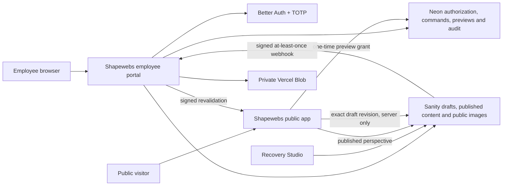

# ADR 0006: Sanity public-content boundary

- Status: accepted for staging
- Date: 29 July 2026
- Owners: Shapewebs owner and platform maintainer

## Context

Shapewebs needs an employee portal that combines company operations with a
high-quality website publishing workflow. The portal must support structured
blog authoring, reusable public website images, private previews, controlled
publishing and recovery without becoming a self-serve website builder.

Neon, Better Auth and private Vercel Blob already own identities,
authorization, audit, customer/company data and confidential files. Replacing
those boundaries with a hosted CMS would weaken the established tenant and
security model. Building every collaborative content primitive from scratch
would add substantial editor, asset and provider-recovery work before the
public website can be designed.

## Decision

Use Sanity only for structured public website content and public website image
assets:

- `apps/admin` remains the normal employee authoring surface.
- `apps/studio` is a provider-recovery and schema-inspection surface. It is not
  the primary employee CMS.
- Sanity's public `staging` dataset contains published public content and
  public media. Draft reads require a Viewer token and mutations require a
  separate Editor token.
- `apps/web` reads the published perspective without a token. Its draft token
  exists only in the exact server-side staging/production environment needed
  for a one-time private preview.
- Better Auth and Neon continue to own employee/customer identity,
  authorization, audit events, durable idempotency commands, preview grants,
  leads, operational state and future customer isolation.
- Private Vercel Blob continues to own confidential employee/customer files.
  A Sanity image must therefore be treated as publicly deliverable.
- Arbitrary HTML is prohibited. Content crosses a strict Zod Portable Text
  contract and is rendered by owned components.
- Publish and unpublish require a fresh TOTP step-up. Every server action
  reauthorizes, checks the expected Sanity revision and reserves a durable Neon
  command before calling the provider.
- A signed, exact-project/dataset webhook records at-least-once delivery in
  Neon and requests exact public cache revalidation.

## Account and data flow

## Security and reliability consequences

- Sanity write and draft credentials never enter a browser bundle, public
  response, repository, log or URL.
- The public app cannot enumerate drafts without both its server-side Viewer
  token and a valid, consumed, tenant-bound Neon preview session.
- A preview is bound to one document, revision, locale, slug and path. Later
  edits fail closed.
- Provider calls are at most once per command ID. A timeout creates an
  `uncertain` command for reconciliation and is not blindly replayed.
- Command completion and the success audit event commit atomically in Neon.
- Webhook signature verification precedes parsing; delivery is deduplicated
  durably, while safe revalidation is repeated when an earlier delivery was
  persisted but not fully processed.
- Sanity's public asset CDN is an explicit CSP/image allowlist exception.
  Third-party browser requests remain limited to content images selected for
  publication.

## Alternatives rejected

- **Replace the platform with Sanity Studio:** rejects the established
  employee/customer identity, TOTP, RLS, operational workflows and private-file
  boundaries.
- **Keep all public content in Neon:** technically viable, but requires
  rebuilding mature collaborative content and public-asset operations before
  the site can be designed.
- **Put confidential files in Sanity:** rejected because public website assets
  and private business/customer documents have different access and retention
  requirements.
- **Expose Sanity drafts through a browser token:** rejected because a leaked
  token would bypass Shapewebs authorization and one-time preview controls.

## Revisit conditions

Revisit only if Sanity cannot meet the measured publishing, availability,
privacy, regional or cost requirements; if the employee portal must support
content types Sanity cannot model safely; or if operating a custom content
store becomes demonstrably simpler than the provider boundary.
