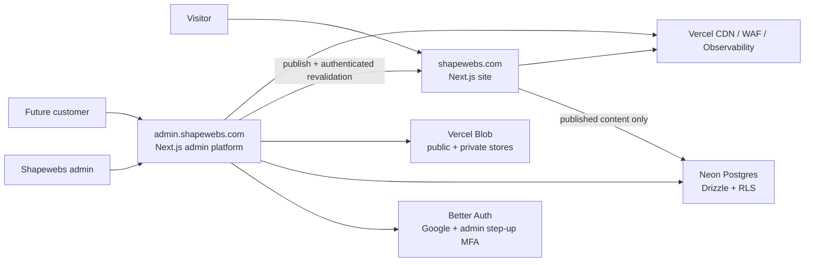

# Shapewebs foundation brief

- Status: recommended architecture
- Researched: 23 July 2026
- Scope: public studio website, custom CMS, admin authentication, and a future
  customer portal

## Executive decision

Build Shapewebs as a small monorepo containing two independently deployed
Next.js applications:

1. **Site** — `shapewebs.com`: the public portfolio and lead-generation site.
   It is static or incrementally regenerated by default, sends very little
   client JavaScript, carries no authentication SDK, and is cached globally.
2. **Admin platform** — `admin.shapewebs.com`: Google sign-in, the custom
   admin CMS, media management, and the first home of the future customer
   portal. It is dynamic where identity requires it and has a separate security
   and performance budget.

Both applications share design tokens, low-level UI primitives, content
validation, and generated database types, but they do not share page-level
components or application logic.

Use Neon for managed Postgres and database branches, Drizzle for typed schema
and reviewed SQL migrations, and a self-hosted Better Auth instance inside the
platform application. Use Vercel Blob for media. Deploy both Next.js
applications as separate projects inside the existing Vercel **Shapewebs**
team. Use GitHub as the source of truth and CI gate.

This is deliberately not a microservice architecture. Two web applications and
one managed data platform are enough. New services should only be introduced
after a measured need.



## Why two applications

The public site and the authenticated product have different constraints:

- The site benefits from static rendering, a tiny dependency graph, no session
  cookies, a narrow Content Security Policy, and maximum CDN cacheability.
- The platform needs sessions, OAuth callbacks, draft content, mutation routes,
  an editor, and richer client interactions.
- A heavy CMS editor can never accidentally enter a public-page bundle.
- A fault or deployment in the CMS does not have to take down the sales site.
- The customer portal has a natural home without turning the public portfolio
  into an authenticated application.
- Vercel supports multiple projects rooted in one monorepo and can skip builds
  for unaffected projects.

One repository still keeps atomic changes, shared types, consistent tooling, and
one pull-request workflow.

## Current public-site baseline

A fresh local Lighthouse run was made against `https://shapewebs.com/` on
23 July 2026. These are lab results from one machine, not field data:

| Metric                      |  Mobile | Desktop |
| --------------------------- | ------: | ------: |
| Performance                 |      90 |      90 |
| Accessibility               |      96 |      96 |
| Best practices              |     100 |     100 |
| SEO                         |     100 |     100 |
| LCP                         |   2.1 s |   0.6 s |
| TBT                         |   50 ms |    0 ms |
| CLS                         |       0 |       0 |
| Speed Index                 |  11.2 s |   5.0 s |
| Transfer size               | 259 KiB | 272 KiB |
| Estimated unused JavaScript |  89 KiB |  89 KiB |

The live response already has HSTS, frame protection, MIME sniffing protection,
and a permissions policy. Keep those strengths. The rebuild should correct:

- The homepage returns HTTP 200 while its `<main>` content region is empty.
- The homepage responds with `private, no-cache, no-store`, so Vercel cannot
  serve it as a durable cached marketing page.
- The production CSP allows both `unsafe-inline` and `unsafe-eval`.
- `X-Powered-By: Next.js` is exposed.
- Lighthouse found insufficient color contrast.
- The very slow Speed Index despite fast LCP suggests content is visually
  delayed, likely by reveal/motion behavior.
- Search engines have indexed `/readme`, which exposes placeholder repository
  instructions. `/about` contains lorem ipsum and placeholder team members.
- Navigation and footer links describe a broad software product rather than a
  focused web-design studio.

The `www` hostname already redirects to the apex domain, and the domain uses
Vercel DNS. No DNS-provider migration is needed.

The verified live repository is a useful structural baseline, but not a
production-quality implementation baseline. It has no tests or CI, reports 35
ESLint errors, contains a broken server/client boundary in the admin webpack
graph, and its production dependency audit reported 15 high-severity findings.
The legacy repository originally reviewed is not deployed. See the
[current-state audit](../audits/current-state-2026-07-23.md).

## Recommended stack

Versions should be exact-pinned by the lockfile and upgraded through reviewed
automated pull requests. The live workspace uses the stable Next.js 16, React
19, Node 24, Tailwind CSS 4, Turborepo 2, and pnpm 10 lines. Patch versions
must be upgraded to verified non-vulnerable releases before feature work. The
architectural commitment is to the stable major lines, not to unbounded
`latest` dependencies.

| Area                | Choice                                                                              | Reason                                                                               |
| ------------------- | ----------------------------------------------------------------------------------- | ------------------------------------------------------------------------------------ |
| Runtime             | Node.js 24 LTS                                                                      | Current LTS line and supported by the selected tools                                 |
| Package manager     | pnpm with Corepack                                                                  | Fast, deterministic workspace installs and strict dependency boundaries              |
| Monorepo            | Turborepo                                                                           | Task graph, caching, affected builds, and first-class Vercel support                 |
| Framework           | Next.js App Router                                                                  | Server Components, static rendering, metadata, image/font/script optimization        |
| UI                  | React 19 + strict TypeScript                                                        | Strong typing and server-first rendering                                             |
| Styling             | Global foundation CSS, CSS custom-property tokens, and component CSS Modules        | Keeps the design system explicit, local, and free of a utility-runtime dependency    |
| Public components   | Custom semantic components                                                          | Keeps the visual identity original and the dependency graph small                    |
| Platform components | Accessible primitives, optionally shadcn/Radix source-owned components              | Speeds up CMS controls without defining the public visual language                   |
| Motion              | CSS first; `motion` only in route-local, lazy-loaded islands when justified         | Prevents animation libraries from becoming a site-wide tax                           |
| Validation          | Zod at every external boundary                                                      | One content contract shared by the CMS, renderer, and tests                          |
| Forms               | Native React/Server Actions; React Hook Form only for complex CMS forms             | Avoids shipping a form abstraction where the browser is enough                       |
| Data                | Neon Postgres                                                                       | Relational model, SQL, backups, preview branches, and future tenant data             |
| Database access     | Drizzle ORM + `@neondatabase/serverless`                                            | Typed queries, committed migrations, and a serverless-safe Neon driver               |
| Authentication      | Self-hosted Better Auth in `apps/admin`                                             | Google OAuth, sessions, and future customer sign-up remain under Shapewebs control   |
| Authorization       | Application permissions plus Postgres roles/RLS                                     | Defense in depth; hiding a route is never treated as authorization                   |
| Admin MFA           | Better Auth TOTP plus a custom OAuth step-up gate                                   | Better Auth does not apply 2FA to social sign-in by default                          |
| Media               | Separate public and private Vercel Blob stores                                      | Published assets can be cached while drafts and future customer files remain private |
| CMS editor          | Custom structured block editor; Tiptap only for rich-text fields that truly need it | Predictable rendering, versioned content, and no arbitrary HTML                      |
| Email               | Resend behind a server-only `packages/email` boundary                               | Typed HTML/text templates with provider code kept out of both client bundles         |
| Email reliability   | Neon transactional outbox, idempotent sends, and signed Resend webhooks             | Persist first, retry safely, and treat email as notification rather than source data |
| Analytics           | Vercel Web Analytics + Speed Insights                                               | Cookie-free traffic analytics plus real-user Core Web Vitals                         |
| Runtime visibility  | OpenTelemetry interface plus Vercel Observability                                   | Portable request/provider/database traces with one initial operational surface       |

### Why Better Auth and Neon

This combination fits the stated preference for ownership without requiring
Shapewebs to operate Postgres itself:

- Better Auth supports Next.js, Google OAuth, database-backed sessions, TOTP,
  and a Drizzle adapter while keeping identity data in Shapewebs' database.
- Neon provides managed Postgres, serverless connections, backups, and isolated
  branches for Vercel previews.
- Drizzle keeps the database schema and generated migrations in Git, where the
  same review and CI controls as application code apply.
- The platform can add customer organizations later without moving users or
  project data into a separate vendor-owned identity plane.

This is the direct, self-hosted Better Auth architecture, not managed Neon Auth.
Managed Neon Auth is convenient, but the direct integration preserves control
over Better Auth plugins, server hooks, authorization, and the required custom
admin MFA flow.

The trade-off is responsibility: Shapewebs owns auth configuration, schema
migrations, email flows, abuse controls, and authorization tests. Those are
first-class code, not deferred launch tasks.

Two constraints are non-negotiable:

1. Better Auth's 2FA plugin does not gate Google/social sign-ins by default.
   Owner and editor sessions therefore pass a separate server-enforced TOTP
   step-up before entering the CMS or making an admin mutation.
2. The application connects to Neon with a non-owner runtime role that has no
   `BYPASSRLS`. The owner/migration credential exists only in CI and controlled
   operational workflows.

### Email delivery architecture

Resend is the transactional email provider, not a data store or workflow
engine:

1. `apps/web` validates and rate-limits a contact request.
2. One application-owned database transaction persists the lead and a typed
   outbox event without granting the web runtime arbitrary email access.
3. `apps/admin` processes the outbox with a sending-only, domain-restricted
   Resend API key. `apps/web` never receives that key.
4. Each send uses both the outbox event ID and a Resend idempotency key. The
   provider message ID, attempt count, and terminal status are persisted.
5. A signed webhook records sent, delivered, delayed, bounced, complained, and
   failed events. Webhook IDs are unique because delivery is at least once and
   ordering is not guaranteed.

Initial lead notifications contain only the submission ID, contact identity,
form type, and a link to the protected CMS. They do not duplicate the message
or project metadata at the provider. Customer-facing acknowledgements are a
separate, explicit product decision and never imply that a project has been
accepted.

Use a dedicated Shapewebs sending subdomain, the Ireland sending region,
receiving disabled, and open/click tracking disabled. Create independent
Development and Production sending-only keys after the domain is verified.
Production keys exist only in `shapewebs-admin`. The outbox remains the durable
source of pending work even if a queue, cron invocation, or Resend is
temporarily unavailable.

## Rendering and performance architecture

### Public site

- Default to Server Components. A component must demonstrate a browser-state
  requirement before receiving `"use client"`.
- Pre-render stable pages. Read published CMS content during generation and use
  tag-based revalidation after a publish event.
- Cache public HTML and content reads. Drafts, previews, contact mutations, and
  admin data must never share that cache.
- Use `next/font` to self-host a variable font. Limit the initial design to one
  variable family plus a system fallback unless a second face has a strong
  visual purpose.
- Use `next/image`, explicit dimensions/aspect ratios, responsive `sizes`, and
  AVIF/WebP output. The LCP image is the only likely eager image.
- Prefer SVG and CSS for the Shapewebs visual language. Do not make WebGL,
  canvas, autoplay video, or a page-wide animation runtime part of the baseline.
- Respect `prefers-reduced-motion`; meaningful content must never depend on a
  reveal animation becoming visible.
- Load analytics and optional third-party scripts after the main content. No
  tag manager at launch.
- Disable the framework signature with `poweredByHeader: false`.

### Platform

- Server-render the authenticated shell and authorize on the server.
- Load the block editor and media tooling only within CMS routes.
- Keep client state feature-local. Do not introduce a global state library until
  React/server state is demonstrably insufficient.
- Paginate media and revision history. Never load the complete library into the
  browser.
- Keep Vercel functions and Neon compute in the same European region.

### Content Security Policy trade-off

Next.js nonce-based CSP forces dynamic rendering, which conflicts with a static
marketing site. Experimental Subresource Integrity is not a sound foundation.
Use separate policies:

- **Site:** static rendering, a very narrow source allow-list, no
  `unsafe-eval`, no remote fonts, and CSP reporting. Cloudflare Turnstile is
  the only allowed interactive third-party script/frame and is loaded only
  with a public form. If Next.js still requires inline bootstrap scripts,
  document the temporary `unsafe-inline` exception rather than weakening other
  directives.
- **Platform:** request nonces with a strict dynamic CSP because authenticated
  pages are dynamic already.

Both policies include `default-src 'self'`, `object-src 'none'`,
`base-uri 'self'`, `frame-ancestors 'none'`, restricted `form-action`, and a
minimal `connect-src`.

## Authentication and authorization model

Roles:

- `owner`: Shapewebs owner; can manage roles, settings, and published content
- `editor`: can create and publish content but cannot manage privileged settings
- `customer`: future portal access scoped to customer organizations/projects
- no role: authenticated but no application access

Rules:

1. Google OAuth authenticates identity; it does not accept a browser-supplied
   role.
2. Only explicitly allowlisted owner identities may create an administrative
   account or session during the one-maintainer bootstrap. Future editors and
   customers require an invitation/assignment flow and cannot self-select.
3. After login, the server resolves the role and sends an owner/editor to
   `/dashboard`. The customer portal remains disabled.
4. Every mutation checks the Better Auth session, role/permission, admin
   step-up state, input schema, and affected resource. Proxy/middleware is only
   an early redirect.
5. Admin mutations require a recent TOTP step-up and are recorded in an
   append-only audit log. A successful Google login alone is insufficient.
6. RLS repeats tenant and content authorization rules in Postgres. Application
   queries establish the request identity inside the database transaction.
7. The runtime database credential is a non-owner role without `BYPASSRLS`.
   The migration/owner credential is never present in browsers or routine
   application requests.
8. Production OAuth redirects are exact allow-list entries. A fixed staging
   hostname is used for OAuth E2E tests rather than allowing arbitrary preview
   URLs.
9. Public customer sign-up remains disabled/undiscoverable until the portal has
   an onboarding and data-retention flow. The schema can be ready before the
   attack surface is opened.

## Custom CMS model

Do not store editable arbitrary HTML. Store versioned, validated content blocks
and render them through a fixed component registry.

Example block types:

- hero
- selected-work grid
- case-study metric
- rich text
- image or image pair
- testimonial
- services list
- process steps
- call to action

Every block has a schema version and Zod schema. Unknown block types or fields
fail publication rather than silently rendering.

Suggested database schemas:

### `content`

- `pages`: slug, locale, template, publication status, SEO fields, current
  published revision
- `page_revisions`: immutable block snapshots, schema version, author, timestamp
- `case_studies`: client-safe title, summary, services, outcome metrics, order
- `media_assets`: storage key, dimensions, MIME type, alt text, focal point,
  attribution
- `redirects`: source, destination/status, reason

Anonymous access can select only published content. Draft/revision writes require
an editor/owner with a recent step-up verification.

### `portal` (designed now, implemented later)

- `organizations`
- `memberships`
- `projects`
- `project_updates`
- `project_milestones`
- `project_files`

RLS scopes every row through membership. Do not add a single `customer_id` check
ad hoc across queries; make tenant ownership part of the relational model.

### `private`

- `audit_events`
- `webhook_deliveries`
- `rate_limit_events` if application-level limiting becomes necessary

No generic database Data API is exposed. Privileged operations go through
narrowly scoped server functions and a restricted runtime database role.

Publishing is transactional:

1. validate the draft against the current content schema;
2. create an immutable revision;
3. update the page's published revision;
4. append an audit event;
5. trigger a secret-authenticated, idempotent revalidation endpoint on the site;
6. keep the last good published revision if revalidation fails and make the
   failure visible in the CMS.

## Repository structure

```text
shapewebs/
├── apps/
│   ├── web/
│   │   ├── public/
│   │   └── src/
│   │       ├── app/
│   │       ├── components/
│   │       │   ├── blocks/
│   │       │   ├── layout/
│   │       │   └── ui/
│   │       ├── features/
│   │       │   ├── case-studies/
│   │       │   ├── contact/
│   │       │   └── navigation/
│   │       └── lib/
│   │           ├── content/
│   │           └── seo/
│   └── admin/
│       └── src/
│           ├── app/
│           │   ├── (auth)/
│           │   ├── (admin)/admin/
│           │   └── (portal)/portal/
│           ├── features/
│           │   ├── auth/
│           │   ├── cms/
│           │   ├── media/
│           │   └── projects/
│           └── lib/
│               ├── auth/
│               └── authorization/
├── packages/
│   ├── auth/
│   ├── config/
│   ├── content-schema/
│   ├── database/
│   ├── design-tokens/
│   ├── observability/
│   ├── ui/
│   └── validation/
├── drizzle/
│   ├── migrations/
│   └── meta/
├── scripts/
│   ├── database/
│   └── maintenance/
├── tests/
│   ├── e2e/
│   ├── load/
│   └── security/
├── docs/
│   ├── decisions/
│   ├── foundation/
│   └── runbooks/
├── .github/
│   └── workflows/
├── pnpm-workspace.yaml
├── turbo.json
└── package.json
```

Structural rules:

- Co-locate feature code; do not create generic `helpers` or `utils` dumping
  grounds.
- `packages/ui` holds low-level primitives only. Public page sections stay in
  `apps/web`.
- `packages/content-schema` is the contract between the CMS and renderer.
- `packages/database` owns the Drizzle schema, restricted query entry points,
  and generated types. SQL migrations are committed so changes are reviewable.
- Apps may depend on packages; packages may not depend on apps.
- Feature boundaries and circular imports are checked automatically.
- Tests sit beside code for units; cross-app E2E/load/security suites live at
  the root.

## Vercel topology

Reuse the two verified live projects in the existing **Shapewebs** Vercel team:

| Vercel project    | Root directory | Production domain     | Purpose                  |
| ----------------- | -------------- | --------------------- | ------------------------ |
| `shapewebs-web`   | `apps/web`     | `shapewebs.com`       | Public site              |
| `shapewebs-admin` | `apps/admin`   | `admin.shapewebs.com` | Auth, CMS, future portal |

Both deploy `shapewebs/shapewebs-platform` from `main`; their current production
baseline is commit `33affde`. The unused Vercel project `shapewebs.com` points
to the legacy repository and has no production deployment. No project named
`shapewebs-accounts` exists. Do not create a replacement project or repoint a
domain during Phase 0. Keep both current production deployments available for
rollback.

Configuration:

- Keep `main` protected and production-only.
- Every pull request gets preview deployments for affected applications.
- Enable “skip unaffected projects”/Turborepo-aware builds.
- Protect preview deployments with Vercel Authentication. Use a fixed,
  protected `staging.shapewebs.com` and `staging-admin.shapewebs.com` for full
  cross-app and OAuth testing.
- Treat Vercel Deployment Checks and required GitHub checks as promotion gates.
- Enable Skew Protection. Rolling releases are optional once traffic justifies
  them.
- Keep `www.shapewebs.com` as a permanent redirect to the apex.
- Choose a Neon EU region and the nearest supported Vercel function region.
  Confirm latency with a deployed probe before fixing the final region. Do not
  let functions default to a US region while the database is in Europe.
- Enable Vercel WAF managed rules, bot protection, firewall visibility, Speed
  Insights, Web Analytics, and Observability where the current plan supports
  them. Treat a paid-plan upgrade as a separate cost decision.
- Configure error/usage alerts if the Vercel plan supports them.
- Store secrets as Vercel sensitive environment variables. Keep public and
  platform variables project-scoped instead of exposing all secrets team-wide.
- Enable automatic system environment variables so Skew Protection can work.

Environment/data isolation uses separate production and non-production Neon
projects so preview branches can never inherit production data:

| Environment  | Vercel                          | Neon                                              | Data                    |
| ------------ | ------------------------------- | ------------------------------------------------- | ----------------------- |
| Local        | local Next.js                   | local Postgres or non-production developer branch | deterministic seed data |
| Pull request | protected preview               | non-production ephemeral branch                   | synthetic data only     |
| Staging      | fixed custom environment/domain | non-production persistent staging branch          | synthetic test accounts |
| Production   | production deployment           | protected production project/branch               | real data               |

Preview and staging must never use the production project. Production data is
not copied into general preview branches.

Database credentials are separated by capability:

- `DATABASE_URL`: pooled/serverless runtime credential, non-owner, no
  `BYPASSRLS`, present only where the application needs it;
- `DATABASE_MIGRATION_URL`: owner or dedicated migrator credential, available
  only to protected migration jobs;
- Better Auth secrets and Google OAuth client secrets: admin project only;
- public and private Blob credentials: scoped to the application and store that
  needs them.

## Performance gates

Core Web Vitals are field metrics. At least 75% of real visits should meet:

- LCP at or below 2.5 seconds
- INP at or below 200 milliseconds
- CLS at or below 0.1

The public site uses stricter lab budgets to leave room for real devices and
networks.

### Pull-request Lighthouse CI gate

Run three mobile-emulated Lighthouse passes for the home page, work index, one
case study, services, and contact page. Use the median and fail on:

- Performance below 95
- Accessibility below 100
- Best Practices below 100
- SEO below 100
- LCP above 2.5 s
- FCP above 1.8 s
- TBT above 150 ms
- CLS above 0.05
- script transfer above 165,000 bytes on the foundation homepage
- total transfer above 210,000 bytes on the foundation homepage
- a new third-party origin without an architecture decision

Lighthouse varies. A failure should block until reproduced or documented; never
“fix” noise by quietly lowering a threshold. Track real-user data through Speed
Insights and treat a field regression as more important than a lab score.
The framework-calibrated foundation values and their measured baseline are
recorded in
[ADR 0002](../decisions/0002-public-performance-budget.md). Add route-specific
media budgets when real case-study assets exist.

The platform starts with performance >= 85 and accessibility 100 in Lighthouse;
its critical gates are interaction latency, correctness, and accessibility.

### Bundle gate

- Run the Next.js bundle analyzer on demand and in a scheduled CI job.
- Record route-level first-load JavaScript in CI.
- A public-route increase over 10 KiB compressed requires an explanation in the
  pull request.
- Use dynamic imports only for interactions that are genuinely deferred; they
  are not a substitute for removing a dependency.

### Load and robustness gate

Use k6 against staging, never an uncontrolled high-volume production test.
Begin with:

- smoke: 1 virtual user on every pull request touching an API;
- average load: 20 virtual users for 5 minutes nightly;
- short spike: 0 to 100 virtual users on an explicitly triggered staging run;
- error rate below 1%;
- public cached request p95 below 200 ms;
- authenticated/read API p95 below 500 ms in the aligned region.

Tune thresholds after establishing a reliable baseline. A load-test pass does
not prove capacity; inspect Vercel and database resource graphs during the run.

## Security and robustness gates

Use OWASP ASVS 5.0 Level 1 as the launch verification baseline, with selected
Level 2 controls for authentication, access control, file handling, logging,
and data protection.

### Every pull request

- TypeScript strict typecheck
- ESLint security/framework/accessibility rules
- unit and integration tests
- database authorization tests for anonymous, owner, editor, and customer
  personas, including RLS policy tests where RLS applies
- OSV scan of `pnpm-lock.yaml`; no unaccepted high/critical vulnerability
- GitHub CodeQL and secret scanning/push protection where the repository plan
  supports them
- Playwright authorization tests that attempt horizontal and vertical privilege
  escalation
- security-header and CSP assertions
- production builds for both affected apps

### Preview/nightly

- OWASP ZAP Baseline passive scan of public and platform staging
- Playwright critical journeys on Chromium, Firefox, and WebKit
- `@axe-core/playwright` checks for automatically detectable WCAG A/AA issues
- k6 smoke/average-load tests
- link, sitemap, canonical, robots, and accidental-route checks

### Security implementation rules

- Validate inputs server-side with explicit size limits.
- Use parameterized Drizzle/Postgres queries; never construct SQL from input.
- With Neon's transaction pooler, set request identity transaction-locally
  (for example with `set_config(..., true)`); never depend on session-level
  `SET` state surviving between queries.
- Authorize every Server Action and Route Handler.
- Do not render arbitrary CMS HTML. Escape text and use a component registry.
- Restrict uploads by role, bucket, MIME type, extension, and size; generate
  server-trusted metadata and random storage keys.
- Rate-limit authentication-adjacent, contact, upload, publish, and revalidation
  endpoints. Add a honeypot to the lead form; introduce a challenge only if
  observed abuse requires it.
- Keep secure headers in automated tests. Include HSTS, CSP,
  `X-Content-Type-Options`, `Referrer-Policy`, and a restrictive
  `Permissions-Policy`.
- Never log access tokens, session cookies, form bodies, customer content, or
  secrets. Use structured logs with request/correlation IDs.
- Record admin changes in an append-only audit log.
- Use least-privilege GitHub, Vercel, Neon, Google Cloud, and domain
  accounts. Require MFA on every operator account.
- Review dependency additions for maintenance, license, bundle cost, and actual
  need.
- Configure daily database backups on a paid production tier. Storage objects
  need a separate backup/export plan because database backups contain storage
  metadata, not file contents.
- Launch target: RPO 24 hours and RTO 4 hours. Before the customer portal stores
  operational customer data, evaluate PITR and tighten the targets.
- Perform a documented restore drill at least quarterly.

No automated scanner can certify a site as secure. Scanners support a threat
model, code review, tested authorization policies, operational controls, and
periodic manual review.

## Test pyramid and tools

| Layer                    | Tool                                                             | Runs                              |
| ------------------------ | ---------------------------------------------------------------- | --------------------------------- |
| Formatting               | Prettier                                                         | editor, pre-commit, CI            |
| Static correctness       | TypeScript, ESLint                                               | local, PR                         |
| Dead code/dependencies   | Knip                                                             | PR when structure changes, weekly |
| Boundaries/cycles        | TypeScript-AST boundary check + Knip                             | PR                                |
| Unit/component           | Vitest, Testing Library                                          | local, PR                         |
| Database/RLS             | disposable Postgres/Neon branch + pgTAP or integration SQL tests | local, PR                         |
| Browser/E2E              | Playwright                                                       | PR critical path; full nightly    |
| Accessibility            | axe in Playwright plus manual keyboard/screen-reader review      | PR + release                      |
| Lab performance          | Lighthouse CI, 3-run median                                      | preview PR                        |
| Field performance        | Vercel Speed Insights                                            | continuous production             |
| Load/soak/spike          | k6                                                               | nightly/manual pre-release        |
| Dependency vulnerability | OSV-Scanner + Dependabot security updates                        | PR/continuous                     |
| Static security          | CodeQL                                                           | PR/scheduled                      |
| Dynamic security         | OWASP ZAP Baseline                                               | nightly/staging                   |
| Production health        | Vercel Observability and alerts                                  | continuous                        |

## Code-hygiene routine

- Developers run `pnpm format` before a pull request; CI enforces the normalized
  result.
- Pull requests run the complete foundation task graph.
- Dependabot opens grouped weekly updates and immediate security updates.
- Knip removes unused files, exports, and dependencies before they fossilize.
- A monthly maintenance issue covers dependency review, deprecations, browser
  support, and bundle reports.
- A quarterly review covers the threat model, admin access, backup restore,
  content-schema migrations, performance budgets, and manual accessibility.
- Architecture decisions live in `docs/decisions/` and explain exceptions,
  particularly new third-party scripts, client state, or cross-app packages.
- Avoid speculative abstractions. Duplicate a small pattern twice before
  deciding whether it is truly shared.

## Company and website direction

Shapewebs should present itself as a focused design-and-engineering studio, not
as a generic agency with every possible service. The strongest differentiator
in this brief is:

> Distinctive web design, engineered for measurable speed and durability.

Possible message directions to test:

1. **Design with character. Built for speed.**
2. **Websites shaped around ambitious businesses.**
3. **Beautiful on purpose. Fast by default.**

The name naturally supports a visual system of changing geometry, framing, and
composition. Use that as a recognizable art direction, but implement it with
typography, CSS, and SVG rather than a heavy 3D showpiece. The site itself should
be evidence of the performance claim.

Recommended initial offer:

- website strategy and art direction;
- bespoke marketing websites;
- interface/design-system work;
- performance, accessibility, and technical SEO;
- launch and continuous improvement/care.

Do not advertise e-commerce, full-service marketing, logo design, software
products, integrations, careers, APIs, or a community until there is a real
offer and proof behind each item.

### Information architecture

- Home
- Work
- Case study detail
- Services
- Process
- About
- Insights (only when there is a sustainable publishing plan)
- Contact / Start a project
- Privacy and terms
- Login link in the footer, leading to `admin.shapewebs.com`

Home-page story:

1. one clear promise and call to action;
2. selected work with real outcomes;
3. focused services;
4. a transparent process;
5. a performance/accessibility proof section using measured data;
6. testimonial or credibility proof;
7. concise project-fit form.

Case studies should explain the problem, constraints, design reasoning, result,
and measured outcome—not only show screenshots. Never invent performance or
conversion claims.

### Decisions needed before visual design

These do not block the technical foundation:

- primary market: Danish/local, international/English, or intentionally
  bilingual;
- ideal client and minimum project size;
- which services have credible portfolio evidence;
- fixed packages versus custom proposals;
- personal studio voice (“I”) versus agency voice (“we”);
- available case studies, testimonials, photography, and outcome metrics.

Do not add localization runtime complexity before the target market is decided.
The CMS schema should include `locale` from the start so bilingual content does
not require a data migration later.

## Phased implementation

### Phase 0 — foundation

- Preserve the existing pnpm/Turborepo workspace and the `apps/web` and
  `apps/admin` deployment boundaries.
- Patch dependencies, fix lint and build boundaries, and make missing
  production configuration fail closed.
- Add strict TypeScript, ESLint, Prettier, Knip, dependency boundaries, Vitest,
  Playwright, and Lighthouse CI.
- Add Better Auth, Neon/Drizzle, committed migrations, deterministic seed data,
  and database-policy tests to the admin application only.
- Keep the two existing Vercel project roots/domains; create the environment
  matrix and connect Neon preview branches.
- Establish design tokens and the public-site performance budget before visual
  experimentation.

Exit: a real minimal homepage and a Google-plus-TOTP protected admin dashboard
deploy through gated previews, while production remains on the known-good
baseline.

### Phase 1 — public studio site

- Define positioning, audience, language, sitemap, and content.
- Create three one-shot visual directions and select one.
- Build the public shell and core pages with content in typed local fixtures.
- Build real case studies and contact capture.
- Complete accessibility, metadata, structured data, redirects, and analytics.

Exit: the new site is content-complete, fast, and deployable without the CMS.

### Phase 2 — custom CMS

- Create structured blocks, media library, revision history, preview, publish,
  audit log, and revalidation.
- Migrate typed fixture content into the CMS without changing the renderer.

Exit: the owner can safely edit, preview, publish, and roll back the public
content.

### Phase 3 — launch hardening

- Run the full performance, browser, database authorization, ZAP, load, and
  ASVS checklist.
- Verify backups and execute a restore drill.
- Promote the verified deployments on the existing domains with Instant
  Rollback ready.
- Redirect or remove indexed placeholder routes such as `/readme`.
- Verify Search Console, sitemap, canonical URLs, and real-user monitoring.

Exit: production launch with measured baselines and runbooks.

### Phase 4 — customer portal

- Implement organizations/memberships and tenant-scoped RLS.
- Add projects, milestones, updates, files, and notifications.
- Enable customer signup/invitations only with a complete onboarding,
  authorization, deletion, and support flow.

## Immediate next build step

Implement Phase 0 only. Do not start visual page work until the repository can
prove:

- both apps build independently;
- public routes contain no Better Auth client or session logic;
- TypeScript/lint/unit/database checks pass;
- the minimal semantic public page meets the Lighthouse budget;
- Vercel preview and production environments are isolated;
- authorization/RLS tests demonstrate that anonymous, admin, and customer
  personas cannot
  cross their intended boundaries.

## Primary sources

- [Next.js App Router](https://nextjs.org/docs/app)
- [Next.js production checklist](https://nextjs.org/docs/app/guides/production-checklist)
- [Next.js Content Security Policy guide](https://nextjs.org/docs/app/guides/content-security-policy)
- [Next.js package bundling](https://nextjs.org/docs/pages/guides/package-bundling)
- [Vercel monorepos](https://vercel.com/docs/monorepos)
- [Vercel environments](https://vercel.com/docs/deployments/environments)
- [Vercel sensitive environment variables](https://vercel.com/docs/environment-variables/sensitive-environment-variables)
- [Vercel regions](https://vercel.com/docs/regions)
- [Vercel Firewall](https://vercel.com/docs/vercel-firewall)
- [Vercel Speed Insights](https://vercel.com/docs/speed-insights)
- [Vercel Observability](https://vercel.com/docs/observability)
- [Vercel Cron Jobs](https://vercel.com/docs/cron-jobs/manage-cron-jobs)
- [Better Auth Next.js integration](https://better-auth.com/docs/integrations/next)
- [Better Auth Drizzle adapter](https://better-auth.com/docs/adapters/drizzle)
- [Better Auth 2FA](https://better-auth.com/docs/plugins/2fa)
- [Neon and Drizzle](https://orm.drizzle.team/docs/get-started/neon-new)
- [Neon branching](https://neon.com/docs/guides/branching-intro)
- [Neon connection pooling](https://neon.com/docs/connect/connection-pooling)
- [Neon Row-Level Security](https://neon.com/docs/guides/row-level-security)
- [Neon for Vercel](https://vercel.com/marketplace/neon)
- [Resend domain management](https://resend.com/docs/dashboard/domains/introduction)
- [Resend domain regions](https://resend.com/docs/dashboard/domains/regions)
- [Resend idempotency keys](https://resend.com/docs/dashboard/emails/idempotency-keys)
- [Resend webhooks](https://resend.com/docs/webhooks/introduction)
- [Core Web Vitals thresholds](https://web.dev/articles/defining-core-web-vitals-thresholds)
- [Lighthouse CI configuration](https://github.com/GoogleChrome/lighthouse-ci/blob/main/docs/configuration.md)
- [Playwright accessibility testing](https://playwright.dev/docs/accessibility-testing)
- [OWASP ASVS 5.0](https://owasp.org/www-project-application-security-verification-standard/)
- [OWASP ZAP Baseline Scan](https://www.zaproxy.org/docs/docker/baseline-scan/)
- [k6 thresholds](https://grafana.com/docs/k6/latest/using-k6/thresholds/)
- [OSV-Scanner](https://google.github.io/osv-scanner/)
- [GitHub CodeQL default setup](https://docs.github.com/en/code-security/how-tos/find-and-fix-code-vulnerabilities/configure-code-scanning/configure-code-scanning)
