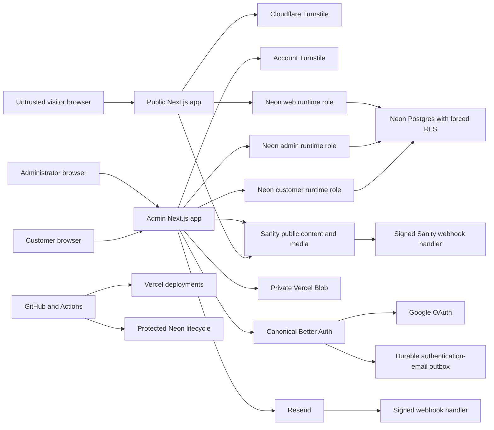
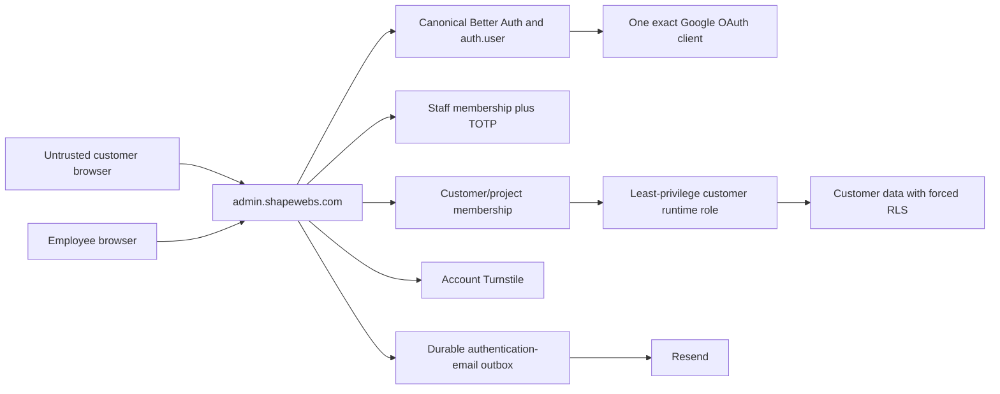

# Shapewebs threat model

- Owner: Shapewebs owner
- Review cadence: quarterly and before every new trust boundary
- Assurance target: OWASP ASVS 5.0 Level 2 for stateful flows; Level 1 for
  static public pages

## System and trust boundaries

The browser, provider callbacks, form input, headers, cookies, webhooks, file
metadata, CMS content, CI input, and deployment previews are untrusted. Better
Auth sessions are identity evidence, not authorization evidence. Memberships,
roles, tenant assignment, resource ownership, and step-up freshness are
re-read from trusted server-side sources.

## Unified customer and employee identity boundary

ADR 0006 supersedes the earlier separate-portal model. `apps/admin` is the one
authenticated application and `auth.user` is the one account identity. Google
and password are attachable login methods on that identity; future passkeys
must attach to the same identity. Staff/customer memberships and separate
least-privilege database repositories remain authorization boundaries, not
alternative authentication realms. Migration `0019` performs fail-closed
legacy reconciliation and must pass disposable conflict, rollback, restore and
RLS verification before staging.

The account surface has one origin, host-only cookie, Better Auth secret,
Google callback and recovery path. No provider account, matching email,
browser input or customer membership grants staff authorization; every studio
entry point re-reads active staff membership and required TOTP freshness.

Planned customer-specific threats and controls are:

| Scenario                              | Required prevention/detection                                                                                | Verification                                                      |
| ------------------------------------- | ------------------------------------------------------------------------------------------------------------ | ----------------------------------------------------------------- |
| Duplicate or implicit account linking | Disable implicit linking; require a signed-in, recently reauthenticated explicit link                        | Same/different-email, provider-subject and concurrent-link tests  |
| Credential stuffing/password spraying | Uniform responses, database/account/IP throttles, firewall controls, conditional Turnstile                   | Distributed spray, shared-IP and lockout-denial tests             |
| Email or account enumeration          | Verified-email signup without automatic session, indistinguishable responses and bounded time                | Existing/non-existing signup and reset timing tests               |
| Invitation theft/replay               | One-time URL exchange, mailbox-owned final password, exact verified email, tenant/project binding and audit  | Forwarded, expired, reused, mismatched and raced invitation tests |
| Last-method removal/account lockout   | Recent reauthentication and refusal to unlink the final verified usable method                               | Google-only, credential-only and dual-method unlink tests         |
| Customer-to-admin privilege crossing  | Independent staff authorization plus TOTP on every studio entry point; separate least-privilege repositories | Same-account customer-only and suspended-staff denial tests       |
| Cross-customer IDOR                   | Server-owned membership/project context, minimal DTOs and forced RLS                                         | Wrong-tenant/project and direct-object misuse tests               |
| Auth-email loss or duplication        | Durable outbox, stable command IDs, retries, webhook deduplication and backlog alerts                        | Provider timeout, worker crash, replay and delayed-delivery tests |

## Protected assets

- Domain, GitHub, Vercel, Neon, Google, Sanity and Resend operator accounts.
- OAuth, database, storage, webhook, Turnstile and deployment secrets.
- Admin sessions, TOTP secrets, backup codes and recovery procedures.
- Lead/customer personal data and private customer files.
- Published content integrity, audit history and email-delivery state.
- Availability of the public site, lead path and administrative recovery.

## Threat scenarios and required controls

| Scenario                       | Boundary                 | Required prevention/detection                                                                         | Verification                                            |
| ------------------------------ | ------------------------ | ----------------------------------------------------------------------------------------------------- | ------------------------------------------------------- |
| Authorization or IDOR bypass   | Browser → admin/data     | Server-owned authorization context, per-action checks, forced RLS, minimal DTOs                       | Anonymous, role and cross-tenant negative tests         |
| OAuth account takeover         | Google → Better Auth     | Exact origins/callbacks, allowlisted owner, state/PKCE, short admin session, mandatory TOTP step-up   | OAuth-state and non-allowlisted-user tests              |
| Password attack/account merge  | Browser → Better Auth    | Allowlist, verified mailbox, HIBP, throttles, no implicit merge, session-bound explicit link and TOTP | Spray, enumeration, reset/replay and link-binding tests |
| Session theft/replay           | Browser → admin          | Secure HttpOnly host-only cookies, database sessions, revocation, inactivity and absolute expiry      | Expired/revoked/replayed-session tests                  |
| CSRF                           | Browser → mutation       | Better Auth origin validation, Next.js Origin/Host checks, exact trusted origins, SameSite cookies    | Cross-origin POST tests                                 |
| Stored content injection       | CMS → public site        | Structured content, no arbitrary scripts/HTML, output encoding, CSP                                   | Malicious-content and CSP tests                         |
| Draft or changed-revision leak | Sanity → public/preview  | Published perspective for public reads; one-time, session-bound exact-revision grants for draft reads | Draft, replay, changed-revision and route-binding tests |
| Ambiguous content mutation     | Admin → Sanity           | Durable command reservation, payload fingerprint, no blind retry and operator reconciliation          | Timeout, duplicate-command and fingerprint tests        |
| Malicious public media         | Browser → Sanity         | Server-owned token, decoded-image type/size/dimension validation and randomized asset identity        | Polyglot, oversize and type-mismatch tests              |
| Malicious private file         | Browser → Blob           | Server-owned token, private access, type/signature/size validation and tenant authorization           | Polyglot, oversize, direct-URL and cross-tenant tests   |
| Lead abuse                     | Browser → form           | Byte/content validation, Turnstile server verification, application and WAF rate limits               | Missing/reused token, flood and oversized-body tests    |
| Lead loss                      | Web → Neon/Resend        | Atomic lead/outbox transaction; email is never the record of truth                                    | Database/provider/worker failure tests                  |
| Webhook forgery/replay         | Provider → admin         | Raw-body signature verification, exact provider scope, event-ID uniqueness and idempotent handling    | Invalid signature, wrong scope, duplicate/order tests   |
| Secret leakage                 | Code/log/CI              | Push protection, secret scanning, typed redacted logging, least-privilege Actions                     | Seeded-secret and redaction tests                       |
| Supply-chain compromise        | Registry/Actions → build | Lockfile, SHA-pinned Actions, dependency review, OSV, CodeQL, Scorecard                               | Clean-runner CI                                         |
| Preview reaches real data      | Vercel → Neon            | Separate non-production project, disposable branches, no production secrets in previews               | Environment inventory and lifecycle test                |
| Destructive migration          | CI → Neon                | Protected environment, dedicated migrator, disposable migration/rollback/restore                      | Neon lifecycle gate                                     |
| Provider outage                | Vercel/Neon/Resend       | Timeouts, durable retries, degraded readiness, monitoring and rollback                                | Fault-injection tests                                   |

## Abuse-case invariants

- Browser-supplied user, organization, role or step-up values are ignored.
- A UI-hidden action remains unauthorized when called directly.
- Validation confirms shape only; ownership is always resolved server-side.
- Successful lead acknowledgement means a durable lead and outbox row exist.
- Retried commands and webhook deliveries do not duplicate side effects.
- Public content reads never return drafts.
- A preview grant can reveal only the exact saved Sanity revision, route,
  locale and slug for which it was issued.
- Preview activation is atomically bound to one server-generated session hash;
  the consumed URL token alone cannot read the grant or draft afterward.
- Sanity is never used for confidential employee/customer files; every asset
  uploaded there is treated as public website media.
- A compromised web runtime cannot read auth, audit, private or cross-tenant
  data.
- A failed dependency does not cause a fail-open authorization decision.

## Change procedure

Every pull request that changes authentication, authorization, persistence,
uploads, forms, email, webhooks, deployment permissions or a provider must:

1. identify the changed trust boundary;
2. update this model and the ASVS matrix if the threat changes;
3. add a negative or failure-mode test;
4. state privacy, performance and rollback impact;
5. link the evidence in the pull request.
